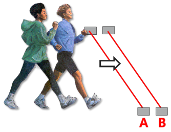

  

   
<b>A real-time people counting system using ultrasonic sensors</b>
  

# PEOPLE INSIDE

# Getting Started

# How To Use

# Classifiaction Algorithm

# Decision Tree

# Performance

### What is a PEOPLE INSIDE System?
- PEOPLE INSIDE System is **a real-time people counting system using ultrasonic sensors**.

### Why did you made this?
- At meal time, there are too many people in a restaurant. So we have to wait in the restaurant. We want to check the number of indoor people in advance.

### Why did you use ultrasonic sensors?
- It is inexpensive so we can make system with low cost.
- It is not affected by various environmental factors.

### Basic Principle& System Architecture
- If the A sensor detects a person first, it means *IN*. And the reverse, it means *OUT*.
- You can check the number of people with application.

 

### Test video
- [Click here](https://www.youtube.com/watch?v=0aNgP3FmK0k) to watch test video.
