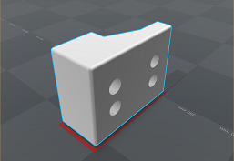
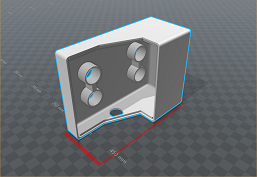
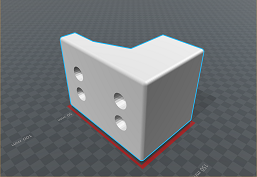
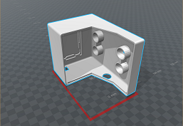
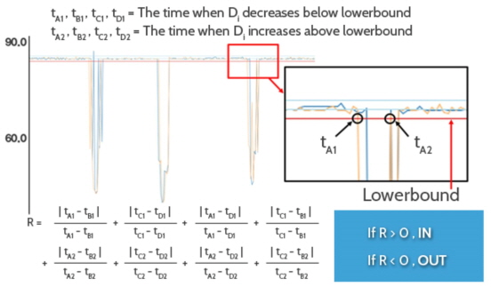
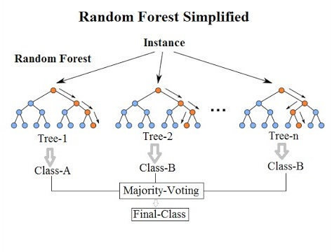

<br>
<p align="center">
  <br><br>
A real-time people counting system using ultrasonic sensors<br>
 <a href="https://github.com/PEOPLE-INSIDE/people-inside"><strong>Visit PEOPLE INSIDE &raquo;</strong></a>
<br><br><br>
</p>

[](#)
[](#)
[](#)

## Table of contents
**1.** [PEOPLE INSIDE](#people-inside)
   - [About](#people-inside)
   - [Purpose](#our-purpose)
   - [Quick Start](#quick-start)
**2.** [Getting Started](#getting-started)
   - [Installation Environment](#installation-environment)
   - [3D Printed Chassis](#3d-printed-chassis)
   - [Basic Principle](#basic-principle)
**3.** [How To Use](#how-to-use)
   - [Classifiaction Algorithm](#classifiaction-algorithm)
   - [Random Forest](#random-forest)
**4.** [Performance](#performance)
**5.** [Components](#hardware)
   - [Hardware](#hardware)
   - [Software](#software)
   - [Open Source](#open-source)
**6.** [Developers](#developers)
**7.** [Paper](#paper)
**8.** [License](#license)

## PEOPLE INSIDE
University students takes classes according to the fixed timetable. At the meal time, too many people crowd into a cafeteria. Sometimes we must go to another cafeteria because there are no enough table. To take matters worse, we don't have much time, because another class begins soon. To have lunch, we have to wait for a seat in the cafeteria or go out to look for another cafeteria. After all, it's a fool's errand. From now we want to avoid this, We want to check the number of indoor people in advance. So, we made it, *PEOPLE-INSIDE*.<br>
*PEOPLE INSIDE* is **a real-time people counting system using ultrasonic sensors**. It uses only four inexpensive ultrasonic sensors to determine the number of indoor personnel. And you can see this number in real time through the application.<br>
**In other words, our system aims to measure indoor congestion metrics.** This can be apply to all indoor rooms as well as university cafeterias.

### Our Purpose
We are focusing on main purposes.
We have three things to aim for :


You don't have to waste any more of your time by checking the number of indoor people with an application.<br>
PEOPLE-INSIDE can be used for various purposes. The use of it is yours.<br>
Only use four inexpensive ultrasonic sensors to determine the number of people.

### Quick Start

```
git clone https://github.com/PEOPLE-INSIDE/people-inside
```

`\projects\arduino` - Include two type of our Arduino source code (Classification / Random Forest)

`\projects\mobile_app` - Include our Android mobile application for display the number of people.

`\projects\3d_modeling` - Include our 3d model chassis for Arduino and ultrasonic sensors.

`\projects\dataset` - Include our all signal dataset for training decision trees.


## Getting Started
### Installation Environment

Before you use our system, make sure the environment fits perfectly. This is a list of necessary things.
- **Arduino UNO** `UNO` becomes the main body to connect the sensors.
- **Ultrasonic sensors** You need four ultrasonic sensors. And these must positioned parallel aligned in two pairs. Prepare inexpensive one which like `HC-SR06` we used.
- **Batteries** If you want to connect wirelessly, you need a battery to supply power.
- **Wifi Shield & Server** It is necessary to send data to the application. The server can use what you want.
- **Application** To view the processed data directly.

We prepared a picture of the architecture. It will help you understand the system.


And this picture depicts our actual test environment.<br>
On the right is the arduino case we made. We recommend you using a 3D printer when making your own.

There is one thing you need to know when you make a case. The ultrasonic sensor sends sound waves and measure the time when sound waves bounce against the wall. Then use the time and the speed of ultrasonic waves to calculate the distance. The case should also act as a barrier to reflecting sound waves. Therefore, make sure that you do not only fills arduino, but also acts as a wall.
The following figures were 3D modelling captures of a case with 3D printing.

 

### 3D Chassis Model
<!--우리는 또한 아두이노 chassis 제작을 위한 3D model도 제공한다.
당신이 3D printer를 사용할 수 있다면 이 모델을 이용하면 된다.
아래 사진은 우리가 제공하는 3D model의 일부 snapshot이다.-->
We also provide 3D model file for making arduino chassis.
You can use this model if you have 3D printer.
Below images are some snapshots 3D models that we provide.


<br>



### Basic Principle
The basic principle what PEOPLE-INSIDE used, is to distinguish between *IN* and *OUT* of the person or people.<br>
Suppose the sensors in the following figures, A and B. If the A sensor detects a person first, it means *IN*. And the reverse, of course it means *OUT*.<br>
The right-hand side is actually a graph of the serial data that the sensor recognizes. *x* axis is time and *y* axis is measured distance. The blue one is the serial data of the A sensor and the yellow one is the B sensor's. You can figure the measured distance of the A sensor decreased first.<br>
So, if you interpret the graph, you can see that the person initially did *IN*. And then he or she did *OUT*.

 

## How To Use
Before you use PEOPLE-INSIDE software, you have two options. Both methods are suggested, so you just pick what you want.

- **Classification Algorithmㅡ** Classification algorithm that classifies Serial datas which one is *IN* and *OUT*.
- **Random Forestㅡ** Machine Learning with data sets what we collected.

Did you choose?

## Classification Algorithm
Only one software tool is needed.
- **Sketchㅡ** To use Classification Algorithm, `the sketch` tool must be installed.

Once the tool installation has been completed, begin explaining the algorithm.
Leave nothing between doors after initial installation. Because the algorithm begins with measuring distance N times between the door.

*why?*
Knowing the distance between the doors sets the standard. Then, calculate the average of the measured distances. And obtain a standard deviation as six sigma from the average. In other words, if the measured distance between the upperbound and the lowerbound, nothing passes. The reason for judging like this is because the measured distances by ultrasonic sensors are very sensitive and accurate.
From the graph, you can see that the measured distances are not represented like linear line.


```
Upperbound & Lowerbound = Average of distance1,2,3,4 ± 6σ
```


So, if the graph deviate from the bound, you realize something goes past the door.

Let me explain why we used *four ultrasonic sensors*, not two.
Initially, two sensors were used in the system. However, when the only two sensors were analyzed and compiled, unexpected events occurred. A typical example is that the measured distances by the two sensors go off at the same time. Without a single error. In this case, the count is an error. And if the count continues to accumulate, this small error becomes unacceptably large. So we increased the number of sensor to four to correct these errors. With four sensors, even one sensor's data is missing, system listens to the others. Increased the number of sensors to increase the accuracy of the system.

After all, if we formulate the Classification algorithm in the way we describe, it looks like the following picture.



```
𝒕_𝑨𝟏,𝒕_𝑩𝟏,𝒕_𝑪𝟏,𝒕_𝑫𝟏 = Time when distance of sensor decreases below lowerbound
𝒕_𝑨𝟐,𝒕_𝑩𝟐,𝒕_𝑪𝟐,𝒕_𝑫𝟐  = Time when distance of sensor increases above lowerbound


𝐑=|𝒕_𝑨𝟏−𝒕_𝑩𝟏|/(𝒕_𝑨𝟏−𝒕_𝑩𝟏)+|𝒕_𝑪𝟏−𝒕_𝑫𝟏|/(𝒕_𝑪𝟏−𝒕_𝑫𝟏)+|𝒕_𝑨𝟏−𝒕_𝑫𝟏|/(𝒕_𝑨𝟏−𝒕_𝑫𝟏)+|𝒕_𝑪𝟏−𝒕_𝑩𝟏|/(𝒕_𝑪𝟏−𝒕_𝑩𝟏 )
+|𝒕_𝑨𝟐−𝒕_𝑩𝟐|/(𝒕_𝑨𝟐−𝒕_𝑩𝟐)+|𝒕_𝑪𝟐−𝒕_𝑫𝟐|/(𝒕_𝑪𝟐−𝒕_𝑫𝟐)+|𝒕_𝑨𝟐−𝒕_𝑫𝟐|/(𝒕_𝑨𝟐−𝒕_𝑫𝟐)+(|𝒕_𝑪𝟐−𝒕_𝑩𝟐|)/(𝒕_𝑪𝟐−𝒕_𝑩𝟐 )

If R>0, IN and if R<0, OUT
```


And there is one more reason for using four ultrasonic sensors. That is to measure multiple people. Usually one person passes by between the doors, but two dry men can pass by, and several people can pass by. We used width to solve this problem.


```
𝒅_𝒘= 𝒅_𝑻−(𝒎𝒊𝒏⁡(𝒅_𝑨 )+𝒎𝒊𝒏⁡(𝒅_𝑪 ))
𝒅_𝒘 is width of passing people
```


## Random Forest
<br>
The second method is classificate using Random Forest (RF) which is one of machine learning algorithm. RF is ensemble method of decision trees. It gives pretty high performance. We provide 2800(1400 each class) dataset, and already implementated in [example code](/projects/arduino/peopleinside.ino) our pre-train RF model by this dataset. Pre-train model was trained by Treebagger function of MATLAB software, and the number of trees are 50.

The model that we provide is perfect adapted in our environment, so it might shows bad performance in your testbed. Therefore, if you don't want to use our RF model, then you can collect your own dataset and train model.
<!--
두번째 Method는 Machine Learning 기법 중 하나인 Random Forest를 이용해 분류하는 것이다.
Random Forest 알고리즘은 Decision tree의 Ensemble 기법으로 높은 정확도를 보인다.
우리는 약 2800개의 Dataset(IN:1400, OUT:1400)을 제공하며, Example code에 이미 이 Dataset으로 학습된 Decision tree Model을 제공한다.
학습된 모델은 MATLAB의 Treebagger function을 이용하여 학습되었으며 트리의 갯수는 50개이다.

우리가 제공하는 모델은 우리의 환경에 최적화되어있기 때문에 당신의 testbed에서는 좋은 성능이 나오지 않을 수 있다.
그렇기 때문에 당신이 우리의 모델을 사용하고 싶지 않다면, 직접 Data를 모아 모델을 만들어 사용 할 수도 있다.
-->

## Performance
The environment for our performance testing is as follows :<br>
`room 306-B, IT building, Gachon University, Republic of Korea`

We set 200 times as a test case and tested it several times. And the test results of one person passing door, the average error rate is 0.01. In other words, there are 1 to 3 errors in one test case (200 times).
And test results of several people passing door, the average error rate is 0.06.
You can also expect similar accuracy if you set the environment properly and apply the software.

If the error rate is too high, it is recommended that the position of the ultrasonic sensors be well set again. This is because ultrasonic sensors are very sensitive.

## Hardware
Click to link detail Specification.
* [Arduino UNO](https://www.arduino.cc/en/main/arduinoBoardUno) X 1
* [HC-SR04 Ultrasonic Sensor](http://www.micropik.com/PDF/HCSR04.pdf) X 4
* [PHPoC Wi-Fi Shield](http://www.phpoc.com/phpoc_wifi_shield.php) X 1
* Jumper Cable (as much as you need)
* [Arduino Chassis](/projects/3d_modeling/) (3D printed)
* [Battery](https://www.amazon.com/Duracell-MN-1604-Pack-MN1604/dp/B004DE54AA/ref=as_li_ss_tl?ie=UTF8&qid=1452883612&sr=8-5&keywords=9v+battery&linkCode=sl1&tag=amandaghassae-20&linkId=71d1e29ec233a9482043ab86519787cd) X 1
* Android Mobile Phone

## Software
Click to Download software.
* [Arduino 1.8.2](https://www.arduino.cc/en/Main/Software) (Arduino IDE Sketch)
* [Android Studio 2.3.2](https://developer.android.com/studio/index.html) (Android programming IDE)
* [MATLAB R2017a](https://www.mathworks.com/products/new_products/latest_features.html) (License needed)<br>
  For signal processing
* Web Server<br>
  Hosting - [Hostinger](https://www.hostinger.kr/)<br>
  PHP<br>
  MySQL<br>

## Open Source
* [Arduino](https://www.arduino.cc)<br>
  Open-source electronic prototyping platform enabling users to create interactive electronic objects.

* [PHPoC](www.phpoc.com/)<br>
  PHPoC Shield for Arduino connects Arduino to Ethernet or Wi-Fi networks.

* [NewPing](http://playground.arduino.cc/Code/NewPing)<br>
  NewPing is Arduino IDE library for easy control ultrasonic sensors.

* [SPI](https://www.arduino.cc/en/reference/SPI)<br>
  Serial Peripheral Interface (SPI) is a synchronous serial data protocol used by microcontrollers for communicating with one or more peripheral devices quickly over short distances.

* [Sketchup](https://www.sketchup.com/ko)<br>
  SketchUp is 3D modeling software that's easy to learn and incredibly fun to use.

## Developers
We have a core project team composed of:

#### [Amber Cho](https://github.com/Seo-Hyung) - Founder/Lead &nbsp;  [](https://github.com/Seo-Hyung) &nbsp; [](https://seo-hyung.github.io) &nbsp;[westbro00@naver.com](westbro00@naver.com)


Amber is a Software Engineer and UI Designer. She always wants to be a competent developer than now, so she is coding today as well. And that her effort are contributing to the team.

#### [Chris Yang](https://github.com/ysm0622) - Founder/Lead &nbsp;  [](https://github.com/ysm0622) &nbsp; [](https://ysm0622.github.io/cv) &nbsp;[ysm0622@gmail.com](ysm0622@gmail.com)


Chris is a Software Engineer and Data Scientist. He loves everything related to computers and data science. His goal of his life is to make small changes in human lives with use of the knowledge he knows.

#### [Martin Kim](https://github.com/skins346) - Founder/Lead &nbsp;  [](https://github.com/skins346) &nbsp; [](#) &nbsp;[skins346@naver.com](skins346@naver.com)


Martin is a Software Engineer, UI Designer, and author of many technical books & tutorials. He oversees the project direction, maintenance and organizes the planning and development efforts of the team.

## Paper
* **A Real-Time People Counting Algorithm using Ultrasonic Sensors** (2016), [[pdf]](./projects/paper/paper_2016.pdf)
* **Design and Performance Comparison of Machine Learning Model for Time Series Data Classification** (2017), [[pdf]](./projects/paper/paper_2017.pdf)

## License
* This project is licensed under the MIT License - see the [LICENSE.md](LICENSE.md) file for details.<br>
