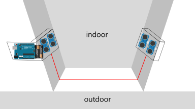
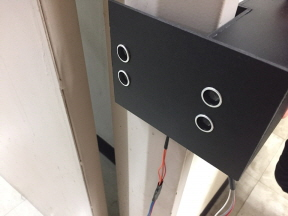
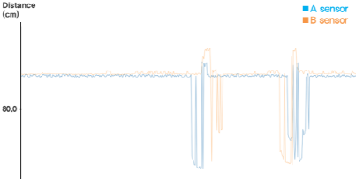
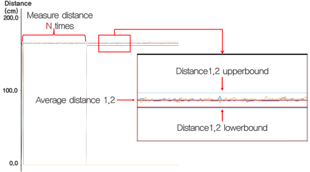

<br>
<p align="center">
  <br><br>
A real-time people counting system using ultrasonic sensors<br>
 <a href="https://github.com/PEOPLE-INSIDE/people-inside"><strong>Visit PEOPLE INSIDE &raquo;</strong></a>
<br><br><br>
</p>

[](#)
[](#)
[](#)

## Table of contents
- [About](#people-inside)
- [Purpose](#our-purpose)
- [Basic Principle](#basic-principle)
- [Quick Start](#quick-start)

## PEOPLE INSIDE
University students takes classes according to the fixed timetable. At the meal time, too many people crowd into a cafeteria. Sometimes we must go to another cafeteria because there are no enough table. To take matters worse, we don't have much time, because another class begins soon. To have lunch, we have to wait for a seat in the cafeteria or go out to look for another cafeteria. After all, it's a fool's errand. From now we want to avoid this, We want to check the number of indoor people in advance. So, we made it, *PEOPLE-INSIDE*.<br>
*PEOPLE INSIDE* is **a real-time people counting system using ultrasonic sensors**. It uses only four inexpensive ultrasonic sensors to determine the number of indoor personnel. And you can see this number in real time through the application. **In other words, our system aims to measure indoor congestion metrics.** This can be apply to all indoor rooms as well as university cafeterias.

### Our Purpose
We are focusing on main purposes.
We have three things to aim for :


You don't have to waste any more of your time by checking the number of indoor people with an application.<br>
PEOPLE-INSIDE can be used for various purposes. The use of it is yours.<br>
Only use four inexpensive ultrasonic sensors to determine the number of people.

### Quick Start

```
git clone https://github.com/PEOPLE-INSIDE/people-inside
```

`\projects\arduino` - Include two type of our Arduino source code (Classification / Random Forest)

`\projects\mobile_app` - Include our Android mobile application for display the number of people

`\projects\3d_modeling` - Include our 3d model chassis for Arduino and ultrasonic sensors.

`\projects\dataset` - Include our all signal dataset for training decision trees.


## Getting Started
### Installation Environment

Before you use our system, make sure the environment fits perfectly. This is a list of necessary things.
- **Arduino UNOㅡ** `UNO` becomes the main body to connect the sensors.
- **ultrasonic sensorsㅡ** You need four ultrasonic sensors. And these must positioned parallel aligned in two pairs. Prepare inexpensive one which like `HC-SR06` we used.
- **batteriesㅡ** If you want to connect wirelessly, you need a battery to supply power.
- **Wifi Shield& Serverㅡ** It is necessary to send data to the application. The server can use what you want.
- **Applicationㅡ** To view the processed data directly.

We prepared a picture of the architecture. It will help you understand the system.


And this picture depicts out actual test environment.<br>
On the right is the arduino case we made. We recommend you using a 3D printer when making your own.

 

### Basic Principle
If the **A** sensor detects a person first, it means *IN*. And the reverse, it means *OUT*.

 

## How To Use
You have to choose one method that you want to use.

- **Classification Algorithmㅡ** Classification algorithm that classifies Serial datas which one is *IN* and *OUT*.
- **Random Forestㅡ** Machine Learning with data sets what we collected.

## Classifiaction Algorithm


## Random Forest
<!--
두번째 Method는 Machine Learning 기법 중 하나인 Random Forest를 이용해 분류하는 것이다.
Random Forest 알고리즘은 Decision tree의 Ensemble 기법으로 높은 정확도를 보인다.
우리는 약 2800개의 Dataset(IN:1400, OUT:1400)을 제공하며, Example code에 이미 이 Dataset으로 학습된 Decision tree Model을 제공한다.
학습된 모델은 MATLAB의 Treebagger function을 이용하여 학습되었으며 트리의 갯수는 50개이다.

우리가 제공하는 모델은 우리의 환경에 최적화되어있기 때문에 당신의 testbed에서는 좋은 성능이 나오지 않을 수 있다.
그렇기 때문에 당신이 우리의 모델을 사용하고 싶지 않다면, 직접 Data를 모아 모델을 만들어 사용 할 수도 있다.
-->

## Performance

## Hardware
* Arduino UNO X 1
* HC-SR06 Ultrasonic Sensor X 4
* PHPoC Arduino Shield X 1
* Jumper Cable (as much as you need)
* Arduino Chassis (3D printed)
* Battery X 1
* Android Mobile Phone

## Software
* Arduino 1.8.2 (Arduino IDE Sketch)
* Android Studio 2.3.2 (Android programming IDE)
* MATLAB R2017a<br>
  For signal processing
* Web Server<br>
  Hosting - [Hostinger](https://www.hostinger.kr/)
  PHP
  MySQL

## Open source
* [Arduino](https://www.arduino.cc)<br>
  Open-source electronic prototyping platform enabling users to create interactive electronic objects.

* [PHPoC](www.phpoc.com/)<br>
  PHPoC Shield for Arduino connects Arduino to Ethernet or Wi-Fi networks.

* [NewPing](http://playground.arduino.cc/Code/NewPing)<br>
  NewPing is Arduino IDE library for easy control ultrasonic sensors.

* [SPI](https://www.arduino.cc/en/reference/SPI)<br>
  Serial Peripheral Interface (SPI) is a synchronous serial data protocol used by microcontrollers for communicating with one or more peripheral devices quickly over short distances.

* [Sketchup](https://www.sketchup.com/ko)<br>
  SketchUp is 3D modeling software that's easy to learn and incredibly fun to use.

## Developers
We have a core project team composed of:

#### [Amber Cho](https://github.com/Seo-Hyung) - Founder/Lead &nbsp;  [](https://github.com/Seo-Hyung) &nbsp; [](https://seo-hyung.github.io)


Amber is a Software Engineer and UI Designer. She always want to be a competent developer than now, so she is coding today as well. And that her effort are contributing to the team.

#### [Chris Yang](https://github.com/ysm0622) - Founder/Lead &nbsp;  [](https://github.com/ysm0622) &nbsp; [](https://ysm0622.github.io/cv)


Chris is a Software Engineer, UI Designer, and author of many technical books & tutorials. He oversees the project direction, maintenance and organizes the planning and development efforts of the team.

#### [Martin Kim](https://github.com/skins346) - Founder/Lead &nbsp;  [](https://github.com/skins346) &nbsp; [](#)


Martin is a Software Engineer, UI Designer, and author of many technical books & tutorials. He oversees the project direction, maintenance and organizes the planning and development efforts of the team.

## License
* This project is licensed under the MIT License - see the [LICENSE.md](LICENSE.md) file for details.<br>
